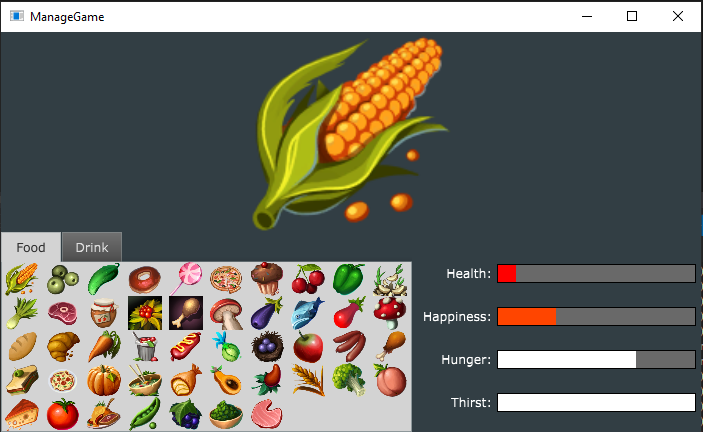
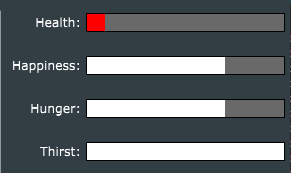
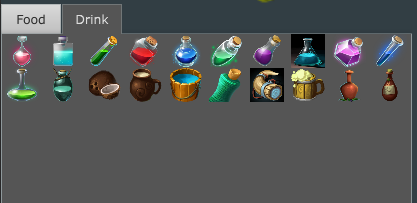
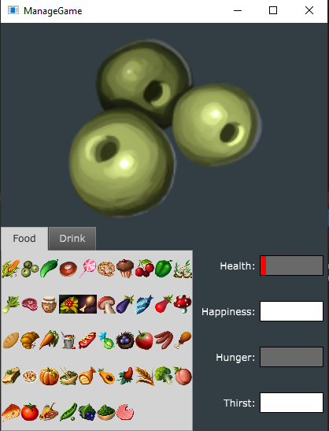

# Game of Resource Management
*Currently being developed*
This game prototype simulates a game of managing resources for a character, choosing different items to use, eat or drink will have different effects on the character's health!

## The Interface and usage

    

This is the simplified interface panel. At the top the main character image is displayed (currently corn).
On the bottom left sits a panel with different tabs, each tab containing a certain amount of usable items.
On the right is the character state displayee with bars.

    

Upon clicking on a certain item, the stats of the character can change in different ways.

    

Different items will result in different actions, also it is not wise to use the same item repeatedly in rapid succession.

    

The panel can be resized in any way desired.

## Planned updates
- Adding more objects.
- Obtaining PNG assets for the avatar.
- Implementing all effects for the different items.
- Implementing other areas of the game, such as death, sports activities etc.
- Implement behavior for repeatedly using the same item.

*© Copyright Andrew Coachman 2021, all rights included*